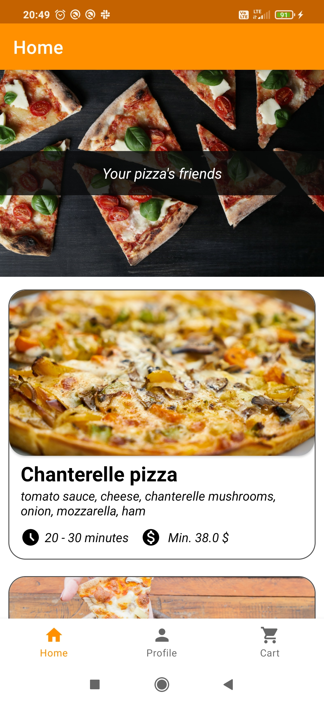
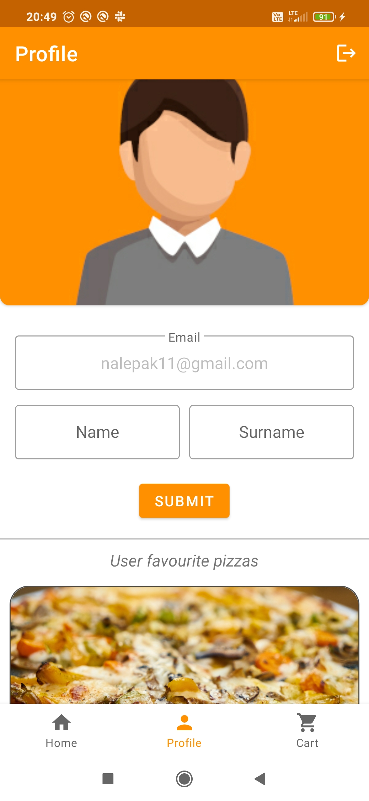
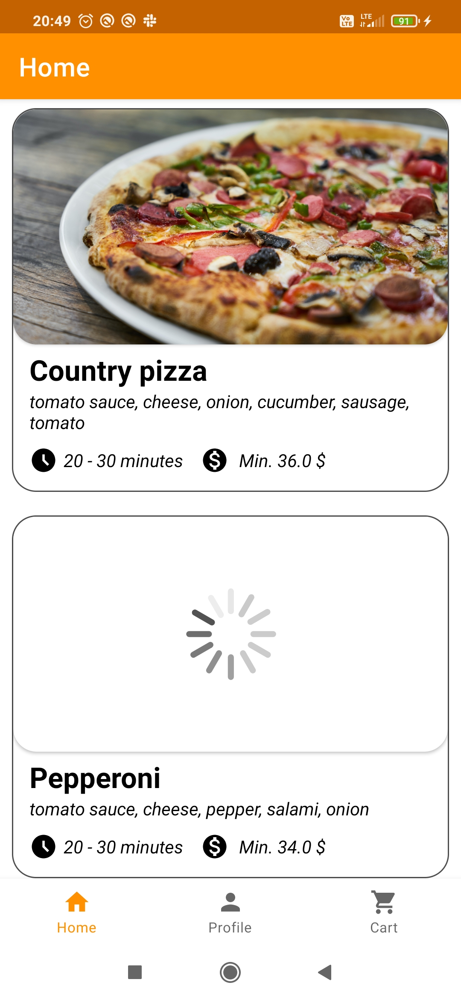
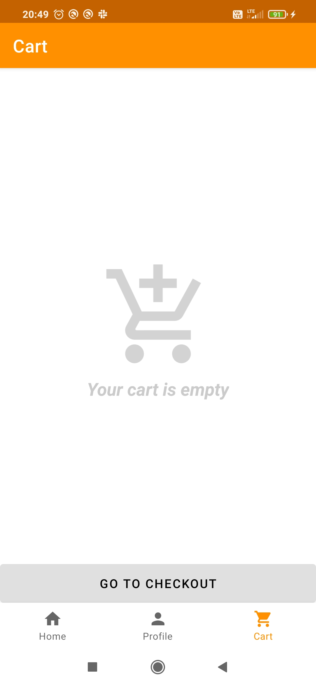
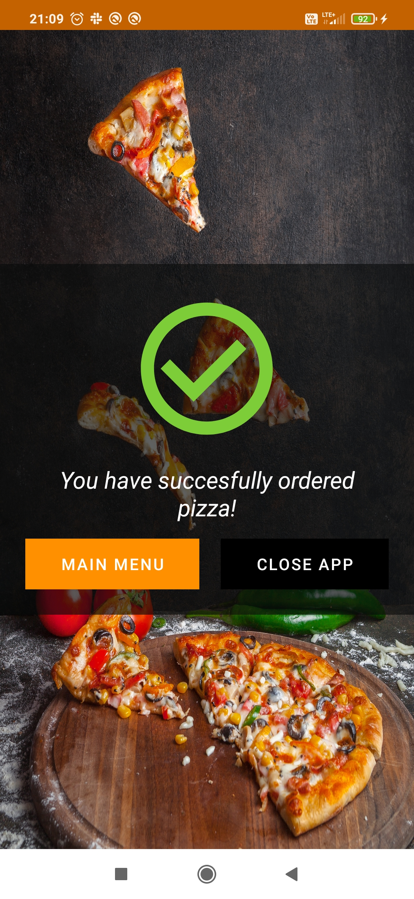

# Pizzeria-Application

## Pizzeria Application is my first more complex application. 
### I built it with Firebase as it's own backend, using following SDK's:
1. Authentication
2. Firestore Database
3. Storage
4. Crashlytics

Pizzeria Application uses following libraries:
+ LiveData 
+ DataBinding
+ Navigation Component
+ Splash Screen Google API
+ Dexter
+ Glide

### Functionalities
It allows user to manually choose between multiple pizzas, add them to shoppping cart and make an order with those yummy meals. User can also manage theirs profile by adding selected pizzas to favourites list, changing his name or surname, and user is able to select his profile picture.

### Screenshots

